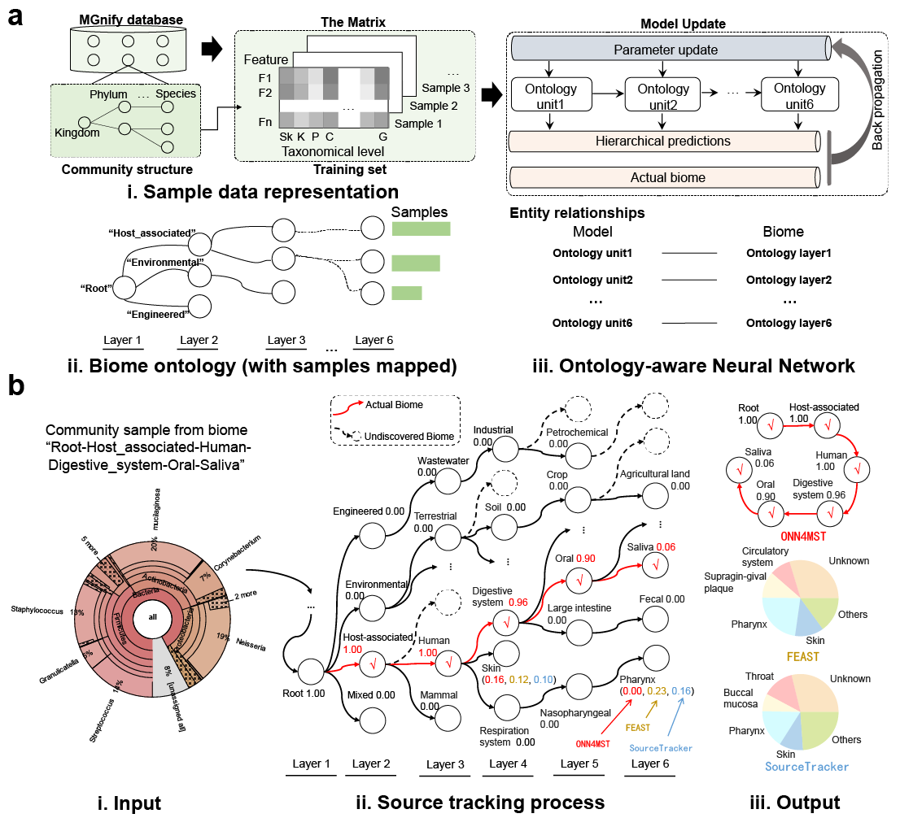
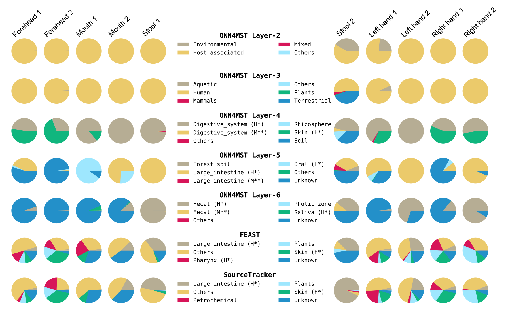

# ONN4MST

Ontology-aware Neural Network for Mircobiome samples Source Tracking!


This program is designed to perform fast and accurate biome source tracking. The ontology of biome is organized to a biome tree, which have six layers. From the root nodes to the leaf nodes, each node has only one parent node. The Neural Network is also organized in six layers, which could produce a hierarchical classification result. The input is a species realtive abundance ".tsv" file, which can be produced by Qiime or get from EBI. The output is a biome source ".txt" file, whcih shows you where the input sample comes from.<br>
The preprocessing program can make the data preprocessing and sample statistics of the Ontology-aware Neural Network easier. For very time-consuming big data calculations, any minor data or program errors can cost days or even weeks. Using this program to check the integrity of all data and error values before processing can greatly reduce the probability of program running errors.

```reStructuredText
.
├── README.md                              : Basic informations for the repository
├── data                                   : Data files for ONN4MST
│   ├── npzs                               : ".npz" files and path files for ONN4MST
│   │   ├── GroundWaterSamplesMatrices.npz : ".npz" files for 11 Groundwater samples mentioned in our study
│   │   ├── GroundWaterSamplesPaths.txt    : Path to 11 Groundwater samples mentioned in our study
│   │   ├── HumanSamplesMatrices.npz       : Path to 10 Human samples mentioned in our study
│   │   └── HumanSamplesPaths.txt          : ".npz" files for 10 Human samples mentioned in our study
│   ├── trees                              : Tree files for ONN4MST
│   │   ├── biome_tree.pkl                 : Tree file containing serialized biome ontology
│   │   ├── ordered_labels.txt             : Biomes involved in the biome ontology
│   │   └── species_tree.pkl               : Phylogenetic tree used by ONN4MST
│   └── tsvs                               : Raw input (".tsv") files for ONN4MST
│       ├── GroundWaterSamplesOTUs.tar.gz  : Compressed 11 Groundwater samples
│       └── HumanSamplesOTUs.tar.gz        : Compressed 10 Human samples
├── environment.yaml                       : Dependencies for ONN4MST
├── image                                  : Images used in README
│   ├── Figure1.png                        
│   ├── Figure2.png                        
│   ├── Supplementary_Figure5.png
│   └── release.png
├── log
│   └── Update.log                         : Updates for each version of ONN4MST
├── src                                    : Source code for ONN4MST
│   ├── dp_utils.py                        : Utility classes for data preprocessing program
│   ├── gen_ontology.py                    : Utility functions for generating biome ontology
│   ├── graph_builder.py                   : Utility for computational graph building of ON4MST
│   ├── predicting.py                      : Utility functions for the prediction function ONN4MST
│   ├── preprocess.py                      : Main preprocessing program
│   ├── searching.py                       : Main searching program
│   └── utils.py                           : Other utility functions for ONN4MST
└── tmp                                    : Temporal files of ONN4MST
    ├── 1462FeaturesIndices.npz            : ".npz" files containing indices for 1462 selected features
    └── error_list                         : Error list of input data files
```


## Support
For support using ONN4MST, please email us. Any comments/insights would be greatly appreciated.

## Installation
We recommend deploying ONN4MST using `git` and `conda`.

```shell
# clone this repository
git clone https://github.com/HUST-NingKang-Lab/ONN4MDM.git
cd ONN4MST

# download and uncompress our model
wget -c https://github.com/HUST-NingKang-Lab/ONN4MST/releases/download/v0.2/config.tar.gz
tar zxvf config.tar.gz

# configure environment using environment.yaml
conda env create -n ONN4MST -f environment.yaml
conda activate ONN4MST
```

## Function

#### Before using
Check if the `preprocess.py` and `searching.py` under `src/` is executable. If they are not executable, type

```shell
chmod +x src/preprocess.py src/searching.py
```
#### Abundance table convert to the Matrix
The input file format of ONN4MST is the ".npz" file. Before ONN, you need to convert the original input ".tsv" file into ".npz" file. The script "src/preprocess.py" could work for it.
#### Microbiome samples source tracking
If you have successfully converted the ".tsv" file into ".npz" file, then you could run the script "src/searching.py" for biome source tracking. Besides, you need also indicate a trained model. We have provided a well trained model as the default model.
## Dependencies

See [environment.yaml](environment.yaml).

## Usage

```shell
usage: preprocess.py [-h] [-p N_JOBS] [-b BATCH_INDEX] [-s BATCH_SIZE]
                     [-i INPUT_DIR] [-o OUTPUT_DIR] [-t TREE] [-c COEF]
                     [--header HEADER]
                     {check,build,convert,count,merge,select}
```

Basically, the `-i`,  `-o` and `-t` arguments for `src/proprocess.py` are used to specify the `input_folder`, `output_folder` and `tree_folder`. 

```bash
usage: searching.py [-h] [-g {0,1}] [-gid GPU_CORE_ID] [-s {0,1}] [-t TREE]
                    [-m MODEL] [-th THRESHOLD] [-of {1,2,3}]
                    ifn ofn
```

The `-m`  and `-t` arguments for `src/searching.py` are used to specify model (".json" file, see release page) and biome ontology (".tree" file under `config`). If you want ONN4MST to run in GPU mode, use `-g 1`.  And the model based on selected features can be accessed by using `-s 1`. 

There are several useful arguments (e.g. `--batch-Size`,  `--batch` and `--n_jobs`) provided in `src/preprocess.py` and `src/searching.py`. You can see them via `-h` option. 

## Input format

The example data can be found [here](data/tsvs). Notice that here is a header "# Constructed from biom file" in the first line.

<table><thead><tr><th colspan="3"># Constructed from biom file</th></tr></thead><tbody><tr><td># OTU ID</td><td>ERR1754760</td><td>taxonomy</td></tr><tr><td>207119</td><td>19.0</td><td>sk__Archaea</td></tr><tr><td>118090</td><td>45.0</td><td>sk__Archaea;k__;p__Thaumarchaeota;c__;o__Nitrosopumilales;f__Nitro...</td></tr><tr><td>153156</td><td>38.0</td><td>sk__Archaea;k__;p__Thaumarchaeota;c__;o__Nitrosopumilales;f__Nitro...</td></tr><tr><td>131704</td><td>1.0</td><td>sk__Archaea;k__;p__Thaumarchaeota;c__Nitrososphaeria;o__Nitrososp...</td></tr><tr><td>103181</td><td>5174.0</td><td>sk__Bacteria</td></tr><tr><td>157361</td><td>9.0</td><td>sk__Bacteria;k__;p__;c__;o__;f__;g__;s__agricultural_soil_bacterium_SC-I-11</td></tr></tbody></table>

You need to process your data and organize them into `input_folder/biome/tsv_files`, just like this.

```reStructuredText
data/tsvs
└── root-Host_associated-Human
    ├── ERR1073574_FASTQ_otu.tsv
    ├── ERR1074236_FASTQ_otu.tsv
    ├── ERR1074237_FASTQ_otu.tsv
    ├── ERR1074238_FASTQ_otu.tsv
    ├── ERR1074494_FASTQ_otu.tsv
    ├── ERR1074498_FASTQ_otu.tsv
    ├── ERR1074499_FASTQ_otu.tsv
    ├── ERR1076801_FASTQ_otu.tsv
    ├── ERR1076805_FASTQ_otu.tsv
    └── ERR1077660_FASTQ_otu.tsv
```

## Demo

Here's a simple example for using ONN4MST to perform microbial source tracking. 

#### **First, check the integrity of your data before doing anything with ONN4MST.**

Generally, If you use files from **MGnify** database, you can just use preprocessing program normally.

```bash
src/preprocess.py check -i data/tsvs
```

But if your ".tsv" files don't have a header in the first line, you need to specify the header argument.

```bash
src/preprocess.py check -i data/tsvs --header 0 
```

The file path and error message of all broken data will be saved to `error_list` and `error_msg`  under `tmp` folder.

#### **Convert ".tsv" files (in MGnify format) to model-acceptable ".npz" file.**

Also, you need to specify the header argument here, take "1" as an example.

```bash
src/preprocess.py convert -i data/tsvs -t data/trees -o data/npzs/ --header 1 --batch_size 10 --batch_index 0 --n_jobs 1
```

#### **Microbiome samples source tracking**.

Perform source tracking using ONN4MST in CPU mode.

```bash
src/searching.py data/npzs/batch_0.npz searching_result.txt -g 0 -s 0 -t config/microbiome.tree -m config/model_df.json -th 0 -of 2
```

## Output format

In the second output format, the predicted sources and their contribution to each sample are given as follows. 

```reStructuredText
>Sample_1	Layer2|root-Engineered,root-Environmental,root-Host_associated...
>Sample_1	Layer2|0.0,4.589534e-06,0.99999374,1.6987236e-06	Layer3|...
>Sample_2	Layer2|root-Engineered,root-Environmental,root-Host_associated...
>Sample_2	Layer2|1.5492266e-06,0.00038966027,0.999591,1.7816106e-05	Layer3|...
```

They can be easily visualized into pie charts.



## Author

   Name   |      Email      |      Organization
:--------:|-----------------|--------------------------------------------------------------------------------------------------------------------------------
Hugo Zha |hugozha@hust.deu.cn|Ph.D. Candidate, School of Life Science and Technology, Huazhong University of Science & Technology
Hui Chong|huichong.me@gmail.com|Research Assistant, School of Life Science and Technology, Huazhong University of Science & Technology
Kang Ning|ningkang@hust.edu.cn|Professor, School of Life Science and Technology, Huazhong University of Science & Technology
